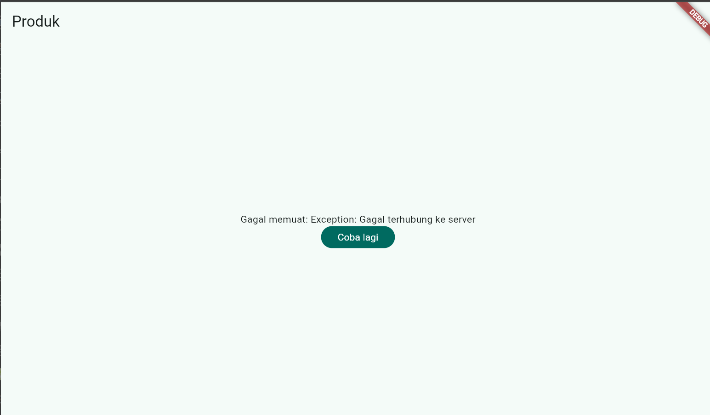
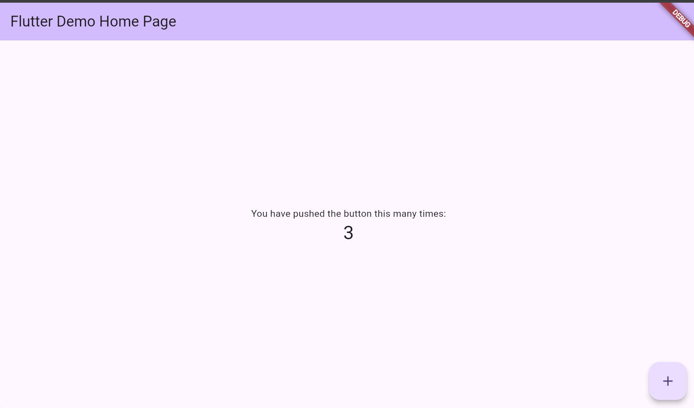
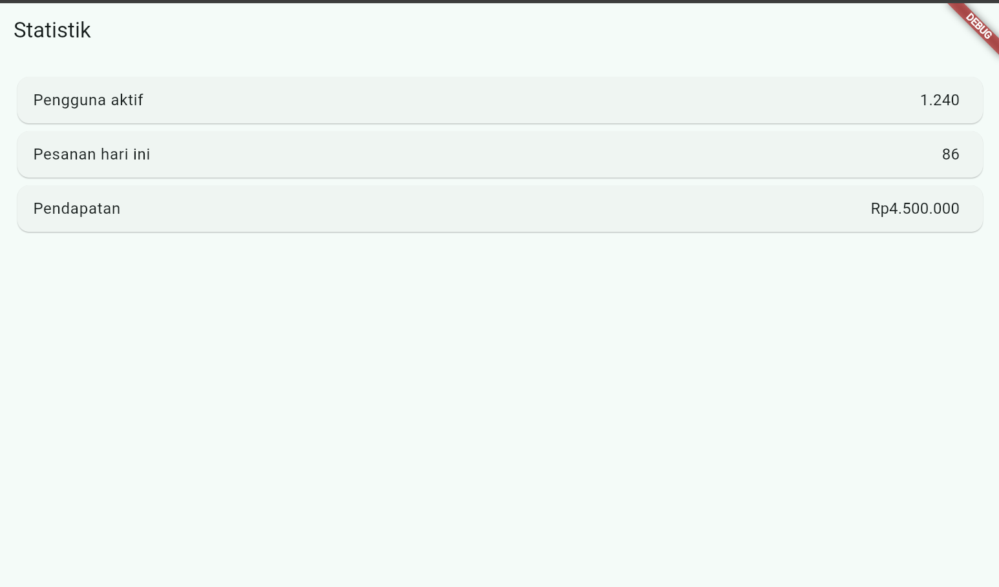
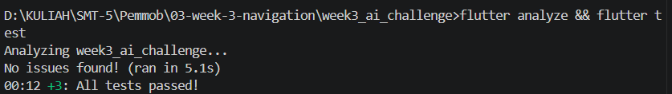

Penjelasan Hasil Pengamatan Praktikum 1

1. Pengamatan Praktikum 1

Hasil :

<table>
  <tr>
    <td>
      
    </td>
    <td>
      
    </td>
  </tr>
</table>

Penjelasan :
1. URL/path berubah otomatis mengikuti layar yang aktif
2. Path yang sama bisa diakses langsung tanpa lewat Home dulu

2. Pengamatan Praktikum 2

Hasil :

<table>
  <tr>
    <td>
      
    </td>
    <td>
      
    </td>
  </tr>
</table>

Penjelasan :
ref.watch di dalam build membuat halaman otomatis ter-rebuild saat daftar berubah, ref.read(todoListProvider.notifier) di dalam callback hanya memanggil method tanpa berlangganan.

3. Praktikum AsyncValue

Hasil :

<table>
  <tr>
    <td>
      
    </td>
  </tr>
</table>

Penjelasan :

AsyncValue

Riverpod menyediakan AsyncValue<T> yang memodelkan ketiga kondisi tersebut dalam satu tipe. Gunakan AsyncNotifier untuk state asinkron.

AsyncValue.guard otomatis menangkap exception dan mengubahnya menjadi AsyncError, hindari blok try/catch manual yang tersebar.

4. Praktikum 3 - Uji Ketiga State

Hasil :

<table>
  <tr>
    <td>
      
    </td>
    <td>
      
    </td>
  </tr>
</table>

Penjelasan :
  1. Amati tampilan loading selama 2 detik pertama.
  
  Saat flutter run, provider di state AsyncLoading. UI menampilkan CircularProgressIndicator selama proses berlangsung. Setelah 2 detik, state berubah menjadi AsyncData, lalu UI success tampil.
  
  2. Mengamati Eror
  
  <table>
    <tr>
      <td>
        
      </td>
    </tr>
  </table>
  
  Penjelasan :
  
  Merubah build() menjadi :
  
      @override
      
      Future<List<Todo>> build() async {
      
        throw Exception('Gagal terhubung ke server');
        
      }
  
  UI masuk ke state AsyncError dan menampilkan pesan eror dan button coba lagi.
  
  3. Tekan tombol Coba lagi, ref.invalidate membuat provider dijalankan ulang. Pulihkan kode, pastikan state success tampil.
  
  Hasil :
  
  <table>
    <tr>
      <td>
        
      </td>
      <td>
        
      </td>
    </tr>
  </table>
  
  Penjelasan :
  
  Tombol coba lagi menjalankan:
  
      ref.invalidate(todoListProvider);
  
  ref.invalidate membuang state provider sebelumnya dan menjalankan ulang build(), setelah kode success, provider akan menghasilkan data dan UI menampilkan state success.
  
  4. Refleksikan: mengapa menampilkan ulang data lama (stale data) dengan indikator refresh kadang lebih baik daripada mengosongkan layar? Kapan pola itu penting?
  
  Saat refresh data, ada 2 pendekatan :
  - Mengosongkan layar lalu menampilkan loading.
  - Tetap menampilkan data lama, sambil menunjukkan indikator refresh.
  
  Menampilkan data lama lebih baik karena pengguna masih bisa membaca atau menggunakan data yang tersedia.

5. AI CHALLENGE

Hasil :

  <table>
    <tr>
      <td>
        
      </td>
      <td>
        
      </td>
      <td>
        
      </td>
    </tr>
  </table>

AI Verification Checklist:
- Apakah state diubah secara immutable (tidak ada state.add() atau mutasi list langsung)?
- Apakah ref.watch hanya dipakai di dalam build, dan ref.read di callback?
- Apakah ketiga state AsyncValue benar-benar ditangani (bukan hanya success)?
- Apakah provider dideklarasikan dengan tipe eksplisit dan tidak duplikat dengan provider lain?
- Apakah kode AI memakai API Riverpod versi lama (StateProvider antipattern, StateNotifierProvider usang, atau Consumer bertingkat yang tidak perlu)? Perbaiki ke pola Notifier/ConsumerWidget.

Jalankan flutter analyze dan flutter test, apakah hasil AI lolos tanpa warning?
- state diubah secara immutable, tidak ada list seperti state.add() / .remove(). Data dikembalikan sebagai const List.
- ref.watch: hanya di build() pada stats_page.dart
- ref.read: digunakan di notifier untuk dependency random pada stats_provider.dart
- Loading, error, dan success ditangani dengan AsyncValue.when()
- Provider bertipe eksplisit dan tidak duplikat pada stats_provider.dart
- Tidak ditemukan StateProvider, StateNotifierProvider, atau nested Consumer.
- Unit test success dan error tersedia pada stats_provider_test.dart

