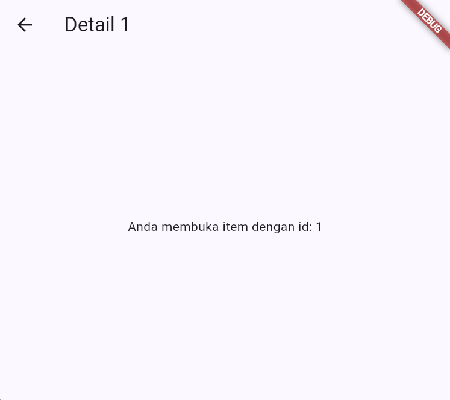

Penjelasan Hasil Pengamatan Praktikum 1

1. Pengamatan Praktikum 1

Hasil :

<table>
  <tr>
    <td>
      
    </td>
    <td>
      
    </td>
  </tr>
</table>

Penjelasan :
1. URL/path berubah otomatis mengikuti layar yang aktif
2. Path yang sama bisa diakses langsung tanpa lewat Home dulu

2. Pengamatan Praktikum 2

Hasil :

<table>
  <tr>
    <td>
      
    </td>
    <td>
      
    </td>
  </tr>
</table>

Penjelasan :
ref.watch di dalam build membuat halaman otomatis ter-rebuild saat daftar berubah, ref.read(todoListProvider.notifier) di dalam callback hanya memanggil method tanpa berlangganan.

3. Praktikum AsyncValue

Hasil :

<table>
  <tr>
    <td>
      
    </td>
  </tr>
</table>

Penjelasan :

AsyncValue

Riverpod menyediakan AsyncValue<T> yang memodelkan ketiga kondisi tersebut dalam satu tipe. Gunakan AsyncNotifier untuk state asinkron.

AsyncValue.guard otomatis menangkap exception dan mengubahnya menjadi AsyncError, hindari blok try/catch manual yang tersebar.

4. Praktikum 3 - Uji Ketiga State

Hasil :

