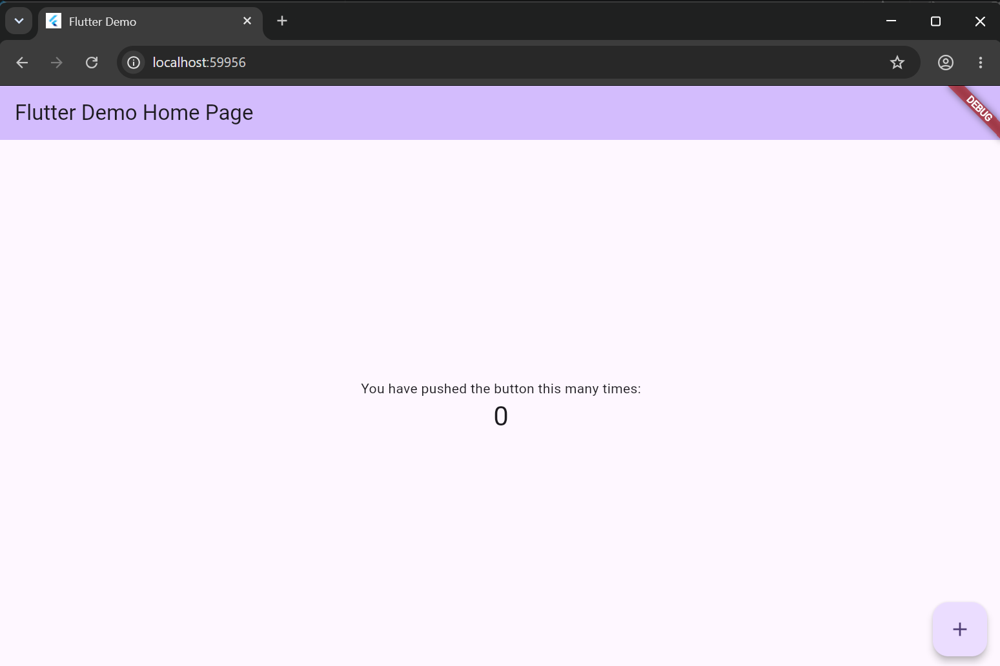
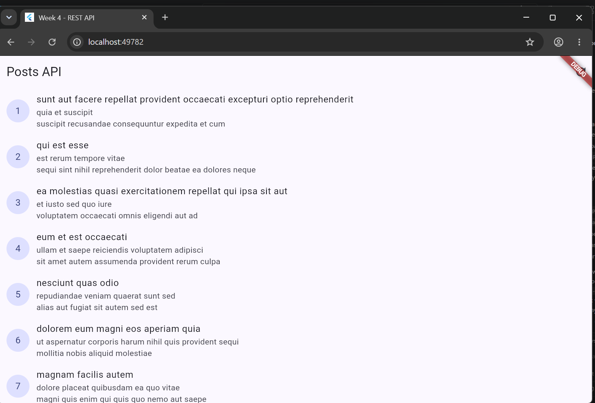
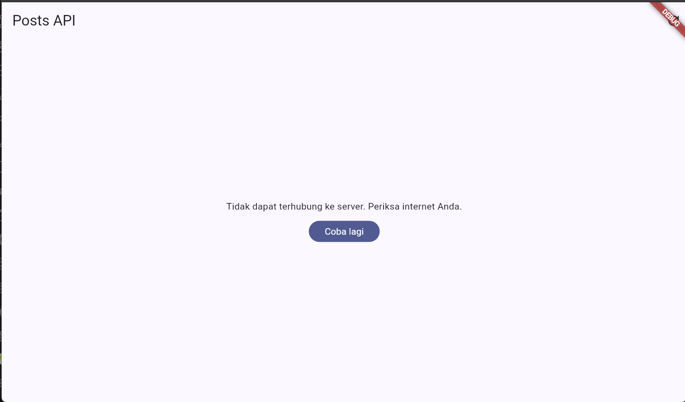
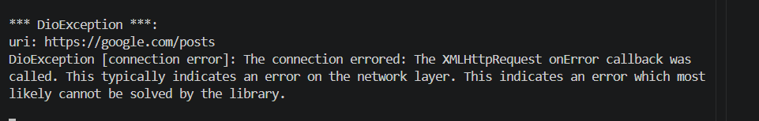
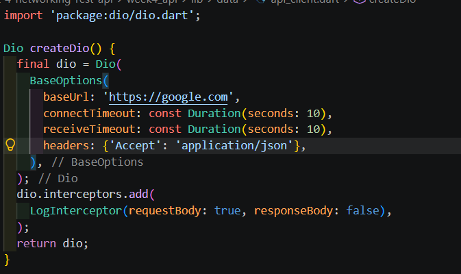

# Praktikum 1
1. Model data dengan fromJson aman null
2. Konfigurasi Dio terpusat
3. Repository sebagai pintu data

Foto:

<table>
  <tr>
    <td>
      
    </td>
</table>

# Praktikum 2
1. Provider AsyncNotifier + pesan error ramah pengguna
2. UI: loading, error, empty, success
3. Entry point dengan ProviderScope

Foto :

<table>
    <td>
      
    </td>
  </tr>
</table>

### Uji skenario error
#### 1. Jalankan aplikasi dengan internet normal, amati loading lalu daftar 100 posts.

   Foto:

   <table>
    <td>
      
    </td>
  </tr>
</table>

#### 2. Matikan internet (mode pesawat), tekan refresh, amati pesan ramah + tombol Coba lagi. Nyalakan kembali internet, tekan Coba lagi.

Foto :

<table>
    <td>
      
    </td>
  </tr>
</table>

#### 3. Sementara ubah baseUrl menjadi URL salah, amati pesan error koneksi. Kembalikan setelah uji.
<table>
    <td>
      
    </td>
  </tr>
      <td>
      
    </td>
  </tr>
</table>
