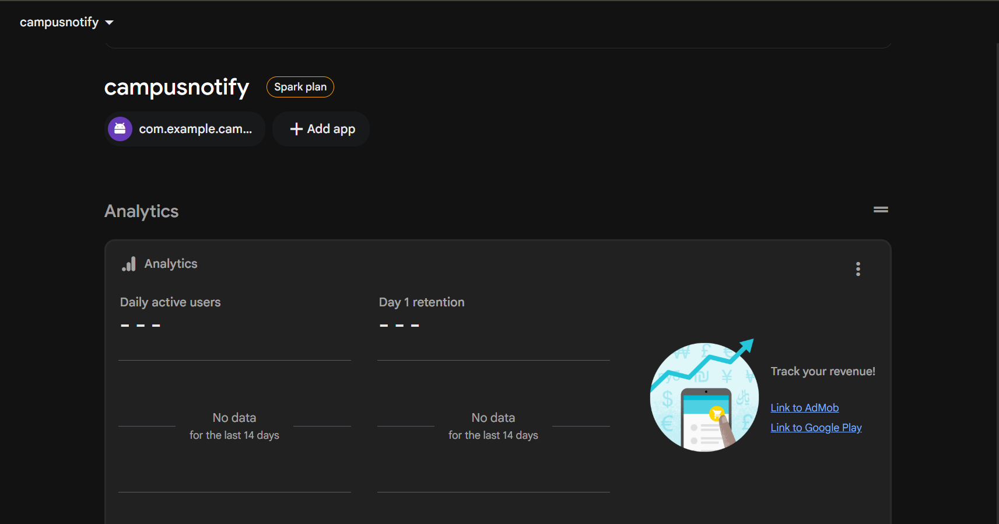
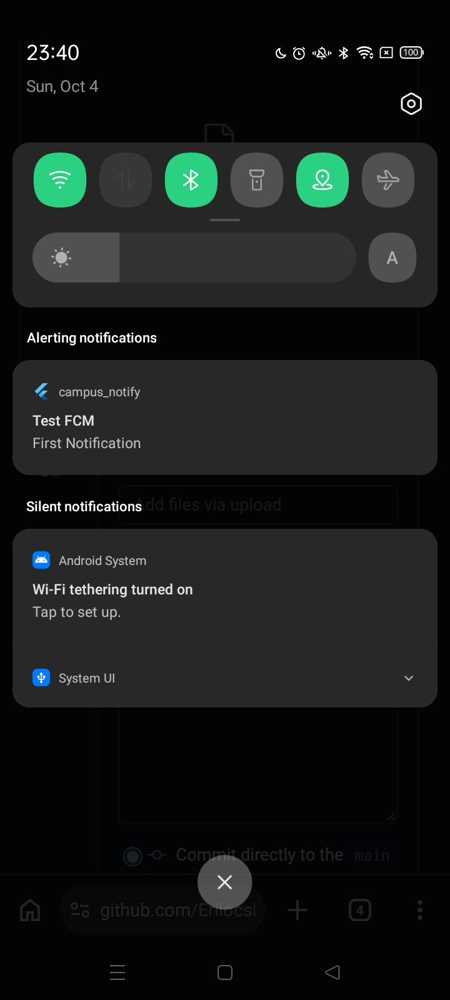
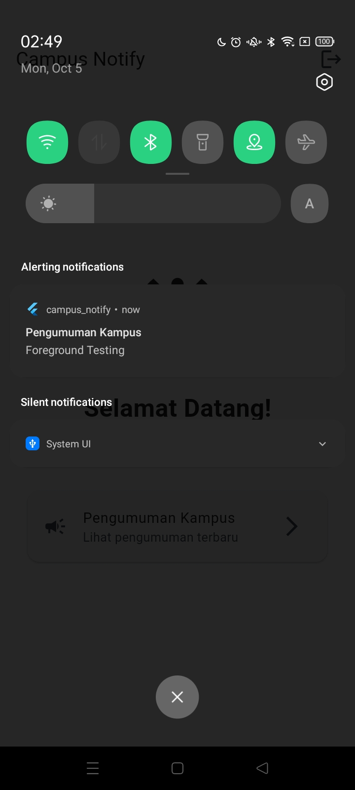
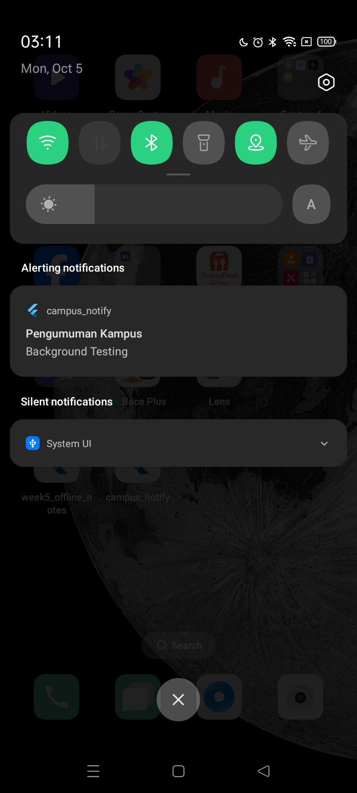
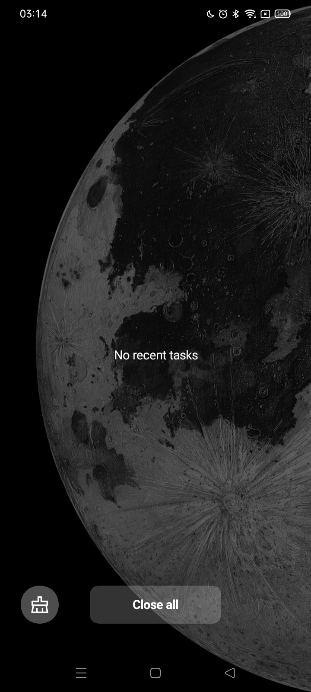

# **Jobsheet 6**
## Praktikum 1
1.  Penyimpanan token yang aman
2.  Repository auth (mock yang siap diganti Firebase Auth)
3.  Dio dengan refresh otomatis
4.  Provider auth + guard route
## Praktikum 2
1. Daftarkan aplikasi ke Firebase

Foto :

<table>
  <tr>
    <td>
      
    </td>
  </tr>
</table>

3. Minta Izin Notification
4. oken lifecycle: ambil, kirim ke backend, pantau perubahan

Test FCM :

<table>
  <tr>
    <td>
      
    </td>
  </tr>
</table>

## Praktikum 3
1. Background handler wajib top-level
2. Tiga handler + contoh payload gabungan
3. Matriks pengujian wajib
- ForeGround
  
  Foto :
  
<table>
  <tr>
    <td>
      
    </td>
  </tr>
</table>
- BackGround

Foto:

<table>
  <tr>
    <td>
      
    </td>
  </tr>
</table>
- Terminated

Foto :

<table>
  <tr>
    <td>
      
    </td>
    <td>
      
    </td>
  </tr>
</table>
4. Topic messaging

# AI CHALLENGE
1. Apakah background handler berupa fungsi top-level dengan @pragma('vm:entry-point')? (tolak jika berupa method kelas).
2. Apakah onTokenRefresh benar-benar mengirim token baru ke backend, bukan hanya dicetak ke log?
3. Apakah foreground memakai local notification manual? (tanpa ini banner tidak muncul saat aplikasi terbuka).
4. Apakah klik dari ketiga state (foreground/background/terminated) masuk ke rute yang benar? Buktikan dengan tabel pengujian.
5. Apakah token/secret tidak di-hardcode dan tidak di-log penuh? Perbaiki bila AI melanggarnya.
6. Keputusan final dan alasan teknis Anda, boleh berbeda dari saran AI selama berargumen.

## JAWABAN
## Verifikasi Fitur Notifikasi

Pada bagian ini dilakukan pengecekan terhadap beberapa fitur utama pada sistem notifikasi aplikasi. Pengujian dilakukan untuk memastikan notifikasi dapat berjalan pada kondisi aplikasi terbuka, di background, maupun saat aplikasi sudah ditutup.

### 1. Background Handler FCM

Fungsi `firebaseMessagingBackgroundHandler` dibuat sebagai fungsi top-level di luar class `PushService`.

Fungsi tersebut juga menggunakan:

```dart
@pragma('vm:entry-point')
```

Penggunaan `@pragma('vm:entry-point')` diperlukan agar fungsi tetap dapat dipanggil ketika aplikasi menerima notifikasi pada kondisi background. Dengan begitu, fungsi tidak ikut dihapus oleh proses optimasi aplikasi saat proses build.

**Status: Berhasil**

---

### 2. Update FCM Token

Aplikasi menggunakan listener `onTokenRefresh` untuk menangani perubahan FCM token.

Ketika token berubah, aplikasi akan:

1. Menerima token baru dari Firebase.
2. Menyimpan token ke `FlutterSecureStorage`.
3. Mengirim token terbaru ke server melalui endpoint `/devices`.

Contoh prosesnya terdapat pada method `_initTokenAndListeners()`:

```dart
_messaging.onTokenRefresh.listen((newToken) async {
  await sendTokenToServer(newToken);
});
```

Dengan cara ini, token yang tersimpan di server tetap mengikuti token terbaru dari perangkat.

**Status: Berhasil**

---

### 3. Notifikasi Saat Aplikasi Dibuka

Saat aplikasi sedang dibuka atau berada pada kondisi foreground, notifikasi dari FCM tidak selalu menampilkan banner notifikasi secara langsung.

Untuk mengatasinya, aplikasi menggunakan `FlutterLocalNotificationsPlugin`.

Alurnya adalah:

```text
FCM menerima pesan
        ↓
FirebaseMessaging.onMessage
        ↓
_showManualLocalNotification()
        ↓
Notifikasi lokal ditampilkan
```

Ketika pengguna menekan notifikasi tersebut, callback `onDidReceiveNotificationResponse` akan dijalankan dan aplikasi memproses route yang terdapat pada payload.

**Status: Berhasil**

---

### 4. Pengujian Navigasi Notifikasi

Pengujian dilakukan pada tiga kondisi aplikasi, yaitu foreground, background, dan terminated.

| Kondisi Aplikasi | Proses                                                   | Handler yang Digunakan             | Hasil                                                    |
| ---------------- | -------------------------------------------------------- | ---------------------------------- | -------------------------------------------------------- |
| **Foreground**   | Notifikasi diterima → banner tampil → notifikasi ditekan | `onDidReceiveNotificationResponse` | Berhasil masuk ke `/pengumuman/:id`                      |
| **Background**   | Notifikasi masuk ke system tray → notifikasi ditekan     | `onMessageOpenedApp`               | Berhasil membuka aplikasi dan masuk ke `/pengumuman/:id` |
| **Terminated**   | Aplikasi ditutup → notifikasi ditekan                    | `getInitialMessage()`              | Aplikasi terbuka dan masuk ke `/pengumuman/:id`          |

Route tujuan diambil dari data notifikasi, khususnya:

```dart
message.data['route']
```

Sehingga notifikasi dapat digunakan untuk membuka halaman tertentu sesuai dengan data yang dikirim oleh server.

**Status: Berhasil**

---

### 5. Penyimpanan dan Keamanan Token

FCM token tidak ditulis langsung di dalam source code.

Token perangkat disimpan menggunakan:

```text
FlutterSecureStorage
```

Base URL dan endpoint API juga menggunakan konfigurasi yang sudah disediakan oleh aplikasi, sehingga tidak perlu menuliskan alamat API secara langsung pada setiap bagian kode.

Untuk proses debugging, token juga tidak ditampilkan secara lengkap pada console. Aplikasi menggunakan fungsi `maskToken()` agar sebagian token disembunyikan.

Contoh tampilan log:

```text
fcm_to...x92k
```

Hal ini dilakukan supaya token tidak mudah terlihat secara lengkap ketika melakukan debugging.

**Status: Berhasil**

# REFACTORING CHALLENGE

1. Pemusatan Rute (lib/routes.dart)

Menambahkan file lib/routes.dart yang berisi konstanta RoutePaths untuk /, /login, dan /pengumuman/:id.
Mengekstrak fungsi murni routeFromMessage(Map<String, dynamic> data) agar rute dari RemoteMessage dapat diolah dan di-test secara independen dari framework FCM.
2. Pesan Ramah Pengguna API (lib/data/api_errors.dart)

Membuat file lib/data/api_errors.dart dengan class ApiErrors berisikan fungsi statis getFriendlyErrorMessage(dynamic error) untuk menerjemahkan DioException (contoh: status kode 401, timeout, offline) ke string Bahasa Indonesia yang mudah dipahami (contoh: "Sesi Anda telah berakhir, silakan login ulang.").
3. Pembaruan Kode Utama (PushService, GoRouter, HomePage)

Rute di lib/main.dart (termasuk redirect logic), dan lib/pages/home_page.dart sudah diganti menggunakan konstanta RoutePaths.
lib/messaging/push_service.dart kini menggunakan fungsi murni routeFromMessage() untuk menangani deeplink, dan memanfaatkan ApiErrors untuk logging/feedback bila request gagal.
4. Penambahan Unit Test (test/auth_push_test.dart)

Menulis file auth_push_test.dart berisi kode test yang Anda berikan, di mana routeFromMessage() diuji independen, dan login logic (memakai FakeTokenStore) dites kemampuannya menangani token statis.
Hasil eksekusi: Seluruh test (routeFromMessage, data payload membawa id, provider auth status login, refresh gagal) LULUS (All tests passed!).
5. Dokumentasi README.md
## Error Umum & Solusinya

| Gejala | Penyebab umum | Solusi |
| :--- | :--- | :--- |
| **Token null di emulator** | Emulator tanpa Google Play Services | Pakai emulator dengan ikon Play Store atau perangkat fisik |
| **Banner tidak muncul saat foreground** | Mengandalkan banner otomatis sistem | Tampilkan manual via flutter_local_notifications di onMessage |
| **Klik notifikasi tidak navigasi (terminated)** | getInitialMessage tidak dipanggil saat startup | Panggil handleTerminated setelah router siap, teruskan data.route |
| **401 berulang meski sudah login** | Interceptor refresh tidak mengulang request / refresh ikut kedaluwarsa | Ulangi request sekali setelah refresh; bila gagal, clear() dan arahkan ke /login |
| **MissingPluginException secure storage / messaging** | Hot reload setelah tambah plugin | Hentikan penuh lalu flutter run ulang |
| **Notifikasi iOS tidak muncul** | Belum ada APNs key / capability push | Konfigurasi APNs di Firebase Console + aktifkan Push di Xcode |

# TUGAS & REFLEKSI

## Penjelasan dan Evaluasi Fitur Notifikasi

### 1. Mengapa Refresh Token Tidak Disimpan di SharedPreferences?

`SharedPreferences` lebih cocok digunakan untuk menyimpan data sederhana seperti pengaturan aplikasi, misalnya tema, status login, atau preferensi pengguna.

Untuk data yang bersifat sensitif seperti **refresh token**, sebaiknya menggunakan penyimpanan yang lebih aman seperti `flutter_secure_storage`.

Jika refresh token disimpan pada tempat yang tidak memiliki perlindungan khusus, risiko keamanan menjadi lebih besar apabila perangkat berhasil diakses secara tidak sah.

Refresh token sendiri cukup penting karena dapat digunakan untuk mendapatkan access token baru. Oleh karena itu, pada aplikasi ini data sensitif disimpan menggunakan:

```text
flutter_secure_storage
```

Dengan begitu, penyimpanan token memanfaatkan mekanisme keamanan yang tersedia pada sistem operasi perangkat.

**Kesimpulan:**
`SharedPreferences` digunakan untuk data biasa, sedangkan token yang bersifat sensitif lebih baik disimpan menggunakan `flutter_secure_storage`.

---

### 2. Apa yang Terjadi Jika `onTokenRefresh` Tidak Ditangani?

FCM token pada perangkat tidak selalu tetap sama. Dalam kondisi tertentu, Firebase dapat memberikan token baru kepada aplikasi.

Jika perubahan token tersebut tidak ditangani, server bisa saja masih menyimpan token lama.

Contohnya:

```text
Token lama
     ↓
Tersimpan di server
     ↓
FCM memberikan token baru
     ↓
Aplikasi tidak mengirim token baru
     ↓
Server masih menggunakan token lama
     ↓
Notifikasi dapat gagal diterima
```

Hal ini dapat menyebabkan pengguna tidak mendapatkan informasi penting seperti pengumuman kampus atau pemberitahuan lainnya.

Karena itu, aplikasi menggunakan `onTokenRefresh` untuk mengirim token terbaru ke server.

Contohnya:

```dart
_messaging.onTokenRefresh.listen((newToken) async {
  await sendTokenToServer(newToken);
});
```

Dengan cara tersebut, token yang digunakan oleh server dapat diperbarui ketika Firebase memberikan token baru.

---

### 3. Kapan Menggunakan Topic dan Kapan Menggunakan Token Perangkat?

FCM menyediakan beberapa cara untuk menentukan penerima notifikasi. Dua cara yang digunakan atau dapat digunakan pada aplikasi adalah **topic** dan **FCM token**.

| Kondisi         | Topic                         | Token Perangkat                    |
| --------------- | ----------------------------- | ---------------------------------- |
| Jumlah penerima | Banyak pengguna               | Satu perangkat / pengguna tertentu |
| Penggunaan      | Informasi umum                | Informasi personal                 |
| Pengelolaan     | Subscribe / unsubscribe topic | Token disimpan di backend          |
| Contoh          | Pengumuman kampus             | Reminder mahasiswa                 |
| Data pribadi    | Sebaiknya tidak               | Dapat digunakan sesuai kebutuhan   |

#### Contoh Topic

Misalnya terdapat topic:

```text
pengumuman-kampus
```

Notifikasi yang dikirim ke topic tersebut dapat berupa:

> Pengumuman: Kuliah umum akan dilaksanakan pada 12 Oktober di Gedung A pukul 09.00.

Informasi seperti ini cocok dikirim ke banyak pengguna sekaligus.

#### Contoh Token Perangkat

Untuk pesan yang hanya ditujukan kepada pengguna tertentu, token perangkat dapat digunakan.

Contohnya:

> Reminder: Anda belum mengisi form absensi praktikum. Silakan mengisi sebelum 20 Oktober.

Pesan seperti ini lebih cocok dikirim berdasarkan perangkat atau pengguna tertentu.

---

### 4. Perubahan yang Dilakukan pada Implementasi

Selama proses pengerjaan, beberapa bagian pada implementasi awal perlu diperbaiki agar fitur dapat berjalan sesuai kebutuhan.

| Bagian                  | Kondisi Awal                                                       | Perubahan                                               |
| ----------------------- | ------------------------------------------------------------------ | ------------------------------------------------------- |
| Background handler      | Sudah menggunakan fungsi top-level dan `@pragma('vm:entry-point')` | Tidak ada perubahan                                     |
| `onTokenRefresh`        | Token baru hanya ditampilkan pada log                              | Token baru dikirim ke endpoint `/devices`               |
| Token dan secret        | Masih terdapat data sensitif yang ditulis langsung pada kode       | Data sensitif dipindahkan ke konfigurasi/secure storage |
| Logging token           | Token ditampilkan secara lengkap                                   | Token pada log dibuat sebagian/di-mask                  |
| Foreground notification | Mengandalkan notifikasi bawaan                                     | Menggunakan `flutter_local_notifications`               |
| Navigasi notifikasi     | Belum diuji pada semua kondisi aplikasi                            | Diuji pada foreground, background, dan terminated       |

Contoh perubahan pada `onTokenRefresh`:

```dart
_messaging.onTokenRefresh.listen((newToken) async {
  await sendTokenToServer(newToken);
});
```

Dengan perubahan tersebut, token baru tidak hanya muncul di console, tetapi juga diperbarui pada backend.

Untuk notifikasi ketika aplikasi sedang dibuka, digunakan local notification secara manual. Hal ini membuat aplikasi tetap dapat menampilkan notifikasi kepada pengguna meskipun aplikasi sedang berada pada kondisi foreground.

### Kesimpulan

Dari beberapa perubahan tersebut, bagian penting yang diperbaiki adalah:

* Menangani perubahan FCM token menggunakan `onTokenRefresh`.
* Menyimpan data sensitif menggunakan penyimpanan yang lebih aman.
* Tidak menampilkan token secara lengkap pada log.
* Menggunakan local notification saat aplikasi dalam kondisi foreground.
* Menguji navigasi notifikasi pada kondisi foreground, background, dan terminated.

Perubahan ini dilakukan supaya fitur notifikasi tidak hanya berjalan ketika aplikasi sedang terbuka, tetapi juga dapat menangani kondisi aplikasi lainnya dengan lebih baik.


